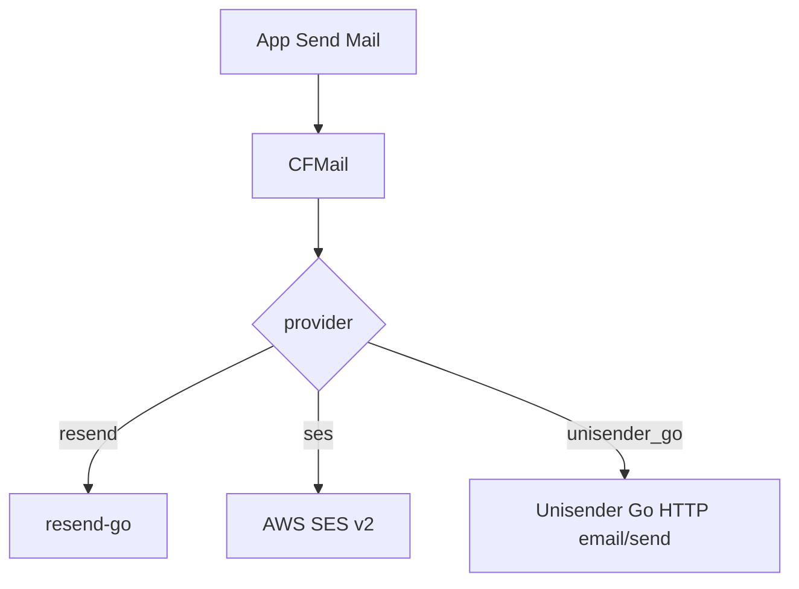

# caerus-framework-mail

[](https://github.com/caerus-framework/caerus-framework-mail/actions/workflows/ci.yml)
[](https://codecov.io/gh/caerus-framework/caerus-framework-mail)
[](LICENSE)

Caerus Framework Mail Component. One chassis for **transactional** email:
apps call `Send(ctx, Mail)` and never import a provider SDK. The active
backend is a config **setting** (`provider`), not a second component type.

Supported providers:

| `provider` | What it is | What it is not |
|---|---|---|
| `resend` | [Resend](https://resend.com) transactional API | — |
| `ses` | Amazon SES **v2** `SendEmail` | SNS, SESv1, campaign tools |
| `unisender_go` | [Unisender Go](https://go.unisender.ru/) `email/send` | Unisender.com **campaign** API (`provider: unisender` is rejected) |

This module **replaces** `caerus-framework-resend` for new products. The
old resend repo stays tagged for existing binaries until they bump.



## Wiring

Two wiring shapes are supported. Prefer the **app-owned** shape (demoapp
golden path): `main` declares only the chassis (mail alongside postgres /
valkey) and the app class; product machinery that sends email lives under the
app and resolves mail as a peer at `Init`. Use the simple `main`-level shape
for one-off binaries.

### App-owned consumer (golden — demoapp pattern)

`main` declares mail as chassis and runs the app class; it never touches
mail itself:

```go
fw := cf.New(&cf.FrameworkOptions{
	Logs: &cf.LogsSettings{Format: "json", Level: "info", ConfigSource: "logs"},
	Observability: &cf.ObservabilitySettings{Bind: ":9090", ConfigSource: "observability"},
	Components: []cf.CaerusComponent{
		cf_postgres.New(cf_postgres.WithConfigSource("postgresql", "config/postgresql.json")),
		cf_mail.New(cf_mail.WithConfigSource("mail", "config/mail.json")),
		app.New(app.Options{}),
	},
})
if err := fw.RunWithSignals(context.Background()); err != nil {
	log.Fatal(err)
}
```

The app resolves the mail **component pointer** once at `Init` (never a
client snapshot), declares it in `GetDependencies`, and calls `Send` per use:

```go
type App struct {
	email *cf_mail.CFMail
}

func (a *App) GetDependencies() []string {
	return []string{cf_mail.ComponentName} // + logs, chassis peers
}

func (a *App) Init(ctx context.Context, fw *cf.CaerusFramework) error {
	email, ok := cf.Get[*cf_mail.CFMail](fw)
	if !ok {
		return errors.New("app: mail component missing")
	}
	a.email = email
	return nil
}
```

### Simple `main`-level wiring

```go
fw := cf.New()
logs := cf_logs.New(cf_logs.WithWriter(os.Stdout))
mailer := cf_mail.New(cf_mail.WithConfigSource("mail", "config/mail.json"))
fw.AddComponent(logs)
fw.AddComponent(mailer) // GetDependencies() -> [logs configuration]
```

In both shapes the component is `cf.ConfigSourceRegistrar`-self-sufficient:
`WithConfigSource` registers `Source[MailConfig]`. `main` never touches
`os.Getenv` / `ParseFlags`. The `--mail` path flag comes from the source
name.

## Sending

`Send` takes a Caerus `Mail` value (SES-simple: From, To, Subject, HTML/Text,
ReplyTo, Tags, optional IdempotencyKey). One extra attempt runs on HTTP
**429** or **5xx** (honor `Retry-After`, wait capped at 1s, stop if `ctx` is
done). 422 and network errors are not retried.

**From:** `from_address` / `WithFromAddress` is a **soft default**. Empty
`Mail.From` uses it. Non-empty `Mail.From` overrides that send. If both are
empty, or the resolved address or any `To` does not parse as an email
(`net/mail.ParseAddress`), Send fails. At least one of HTML or Text is required.

`IdempotencyKey` is sent to Resend and Unisender Go. SES v2 `SendEmail` has
no matching field — it is ignored there.

Attachments, Cc/Bcc, and scheduled send stay on the provider escape hatches
(`ResendClient()`, `SESClient()`). Those return nil when the active provider
is a different backend. Unisender Go has no SDK accessor; extra fields stay
off `Send` on purpose (transactional body only).

```go
a.email, _ = cf.Get[*cf_mail.CFMail](fw)

id, err := a.email.Send(ctx, cf_mail.Mail{
	To:      []string{"user@example.com"},
	Subject: "Welcome",
	HTML:    "<p>Hi!</p>",
})
if err != nil {
	if cf_mail.HTTPStatus(err) == 429 {
		// rate limited
	}
	return err
}
```

Peers resolve the component once at `Init` (declare `cf_mail.ComponentName`
in `GetDependencies`) and call `Send` per use — never snapshot a provider
client, since config reload swaps it.

## Configuration

Shared settings sit at the **top** of the file. Each provider has a nested
object. Only the nested blob for the active `provider` is required.

The configuration env overlay does **not** walk nested structs, so local
`go run` uses flat `MAIL_*` aliases (same idea as valkey-state
`RATE_LIMIT_*`). In Kubernetes the nested JSON/YAML file is canonical.

```json
{
  "provider": "resend",
  "from_address": "noreply@example.com",
  "timeout_sec": 10,
  "resend": {
    "api_key": "re_…",
    "base_url": ""
  },
  "ses": {
    "region": "eu-central-1",
    "access_key_id": "",
    "secret_access_key": "",
    "endpoint": ""
  },
  "unisender_go": {
    "api_key": "",
    "base_url": "https://goapi.unisender.ru/en/transactional/api/v1",
    "skip_unsubscribe": true
  }
}
```

Default `EnvPrefix` is `MAIL_` (from the source name `mail`).

| Setting | File | Env (prefix `MAIL_`) |
|---|---|---|
| Provider | `provider` | `MAIL_PROVIDER` |
| Soft-default From | `from_address` | `MAIL_FROM_ADDRESS` |
| HTTP timeout seconds | `timeout_sec` | `MAIL_TIMEOUT_SEC` |
| Resend API key | `resend.api_key` | `MAIL_RESEND_API_KEY` |
| Resend base URL | `resend.base_url` | `MAIL_RESEND_BASE_URL` |
| SES region | `ses.region` | `MAIL_SES_REGION` |
| SES access key | `ses.access_key_id` | `MAIL_SES_ACCESS_KEY_ID` |
| SES secret | `ses.secret_access_key` | `MAIL_SES_SECRET_ACCESS_KEY` |
| SES endpoint (LocalStack) | `ses.endpoint` | `MAIL_SES_ENDPOINT` |
| Unisender Go API key | `unisender_go.api_key` | `MAIL_UNISENDER_GO_API_KEY` |
| Unisender Go base URL | `unisender_go.base_url` | `MAIL_UNISENDER_GO_BASE_URL` |
| Skip unsubscribe block | `unisender_go.skip_unsubscribe` | `MAIL_UNISENDER_GO_SKIP_UNSUBSCRIBE` |

**Wrong vs right:**

```text
Wrong: provider "unisender"  → campaign Unisender.com API (not implemented)
Right: provider "unisender_go" → transactional email/send on goapi.unisender.ru
```

### SES credentials (two exclusive paths)

**Path A — file keys (local / explicit):** set both `access_key_id` and
`secret_access_key` in the nested `ses` object (or the matching `MAIL_SES_*`
env aliases). One without the other is an Init error.

**Path B — default AWS chain (recommended in cluster):** leave both keys
empty. The AWS SDK uses IRSA / instance role / shared config. `region` is
still required.

### Unisender Go

Default base URL is `https://goapi.unisender.ru/en/transactional/api/v1`.
Override `base_url` for the go1/go2 datacenter your account is on. Auth is
the `X-API-KEY` header. `skip_unsubscribe` defaults **on** (value 1) so
transactional mail does not get a campaign unsubscribe footer; set
`skip_unsubscribe: false` only if Unisender support enabled that for you.

`Send` returns the Unisender Go `job_id`. If every `To` address is in
`failed_emails`, Send fails.

**Files are canonical in Kubernetes**, including API keys — mount a
Secret/ConfigMap and let `fsnotify` + `OnConfigReload` rotate the sender
without a restart. Nested `api_key` / `secret_access_key` are tagged
`secret:"redact"`. On reload failure the previous sender stays live
(last-good).

`Health` reports initialized/uninitialized (no provider liveness probe; send
failures surface per call). `Metrics` emits the following while initialized,
nil before Init/after Shutdown:

| Metric | Type | Labels |
|---|---|---|
| `mail_info` | gauge 1 | `component`, `provider`, `from` |
| `mail_config_reloads_total` | counter | `component` |
| `mail_emails_sent_total` | counter | `component`, `from` |
| `mail_send_retries_total` | counter | `component`, `from` |
| `mail_send_duration_seconds_sum` | counter | `component`, `from` |
| `mail_send_duration_seconds_count` | counter | `component`, `from` |
| `mail_emails_failed_total` | counter | `component`, `from`, `error_code` |

The `from` label on traffic counters is the **actual sender of each email**.
`error_code` is the HTTP status or `network`.

## Options

| Option | Description |
| --- | --- |
| `WithConfig(MailConfig)` | static snapshot; non-zero fields override option-set defaults |
| `WithConfigSource(name, path, …)` | bind a configuration source for Init + `OnConfigReload` |
| `WithProvider(name)` | `resend`, `ses`, or `unisender_go` |
| `WithFromAddress(from)` | soft-default sender |
| `WithTimeout(d)` | per-send HTTP timeout (default `10s`) |
| `WithHTTPClient(*http.Client)` | stub RoundTripper in tests; used by every provider |
| `WithResendAPIKey` / `WithResendBaseURL` | Resend construct-time |
| `WithSESRegion` / `WithSESCredentials` / `WithSESEndpoint` | SES construct-time |
| `WithUnisenderGoAPIKey` / `WithUnisenderGoBaseURL` | Unisender Go construct-time |
| `WithName(name)` | custom component name (default `"mail"`) |
| `WithLogger(*slog.Logger)` | explicit logger override |

## Tests

Unit tests cover config layering, the Init contract, all three providers
(stub `http.RoundTripper`), reload last-good, and health/metrics — no
external service.

## License

Apache License 2.0 — see [LICENSE](LICENSE).
